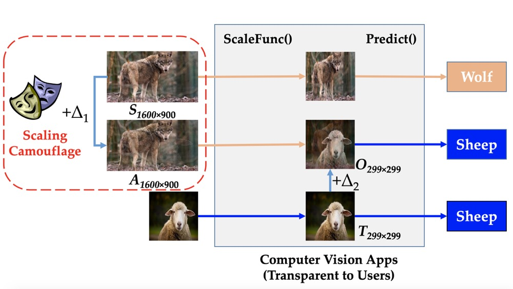

## Scaling Attack against Computer Vision Applications
### Introduction

The scaling attack exploits the information loss phenomena in the image down-scaling process. It aims to hide a small target image into a large source image (in our example, we hide a 229 $\times$ 229 wolf image into a 1800 $\times$ 1200 sheep image). After down-scaling, these "sheep" pixels are discarded, while the "wolf" image gets recovered and fed into downstream computer vision applications. As a result, a sheep image to human eyes will be classified as a wolf by computers.

<p align="center">

</p>

For more details, please refer to our [USEXNI Security][https://www.usenix.org/conference/usenixsecurity19/presentation/xiao] and [TDSC][https://ieeexplore.ieee.org/abstract/document/8982037] paper.

### Getting Started
#### Setup:
```
chmod +x setup.sh
./setup.sh
```

#### Run the attack
```
python ./attack.py --sourceImg <source image path>
                   --targetImg <target image path>
		               --attackImg <where to save the attack image>
		               --outputImg <output image path>
                   --norm <choose $L_p$ attack norm to use>
		               [--resizeFunc <resizing function>]
		               [--interpolation <interpolation method>]
		               [--penalty <constant $c$ set in the attack>]
		               [--imageFactor <factor used to scale image pixel value to [0,1]>.]
```
For example, you can run this:
```
python ./attack.py --sourceImg sheep.jpg --targetImg wolf.jpg --attackImg attack.jpg --outputImg attack_downscaled.jpg --norm l2 --resizeFunc cv2.resize --interpolation cv2.INTER_LINEAR --penalty 0.01
```
For more details, you can run:
```
python ./attack.py --help
```
---

### Notes

* The code is running on Python3
* Supported scaling functions:
<table>
    <tr>
        <td><b>Function</b></td>
        <td><b>Interpolation methods</b></td>
    </tr>
    <tr>
        <td rowspan="5">cv2.resize</td>
        <td>cv2.INTER\_NEAREST</td>
    </tr>
    <tr>
        <td>cv2.INTER\_LINEAR</td>
    </tr>
    <tr>
        <td>cv2.INTER\_CUBIC</td>
    </tr>
    <tr>
        <td>cv2.INTER\_AREA</td>
    </tr>
    <tr>
        <td>cv2.INTER\_LANCZOS4</td>
    </tr>
    <tr>
        <td rowspan="4">Image.Image.resize</td>
        <td>Image.NEAREST</td>
    </tr>
    <tr>
        <td>Image.LANCZOS</td>
    </tr>
    <tr>
        <td>Image.BILINEAR</td>
    </tr>
    <tr>
        <td>Image.BICUBIC</td>
    </tr>
</table>

### Publications 
[1] _Qixue Xiao\*, Yufei Chen\*, Chao Shen, Yu Chen, and Kang Li._ [Seeing is Not Believing: Camouflage Attacks on Image Scaling Algorithms](https://www.usenix.org/conference/usenixsecurity19/presentation/xiao), (USENIX Security '19) (*: co-first author)

[2] _Yufei Chen, Chao Shen, Cong Wang, Qixue Xiao, Kang Li, and Yu Chen._ [Scaling Camouflage: Content Disguising Attack Against Computer Vision Applications](https://ieeexplore.ieee.org/abstract/document/8982037) (IEEE TDSC)

### Citations
```
@inproceedings {xiao2019_usenix,
author = {Qixue Xiao and Yufei Chen and Chao Shen and Yu Chen and Kang Li},
title = {Seeing is Not Believing: Camouflage Attacks on Image Scaling Algorithms},
booktitle = {28th {USENIX} Security Symposium ({USENIX} Security 19)},
year = {2019},
pages = {443--460},
publisher = {{USENIX} Association},
month = aug,
}

@article{chen2020_tdsc,
author={Yyufei Chen and Chao Shen and Cong Wang and Qixue Xiao and Kang Li and Yu Chen},
journal={IEEE Transactions on Dependable and Secure Computing}, 
title={Scaling Camouflage: Content Disguising Attack Against Computer Vision Applications}, 
year={2020},
pages={1-1},
doi={10.1109/TDSC.2020.2971601}
}
```
